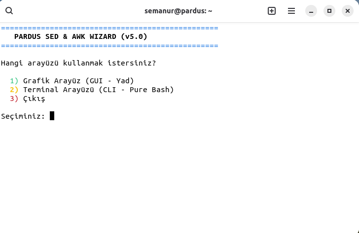
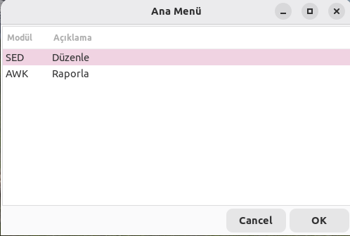
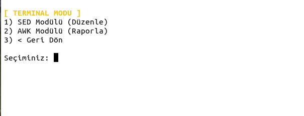

# pardus-sed-awk-wizard

**Pardus Sed & Awk Wizard**, Linux terminalindeki karmaşık metin işleme komutlarını herkes için erişilebilir kılan, hata kontrollü ve çift arayüzlü (GUI & TUI) bir otomasyon aracıdır.

> **English:** A dual-interface (GUI/TUI) Bash automation tool designed for Pardus Linux that simplifies complex `sed` and `awk` text processing operations with safety checks and real-time previews.

---

## 📺 Demo Video & Tutorial

Projenin nasıl çalıştığını ve özelliklerini aşağıdaki videodan izleyebilirsiniz:

[](https://www.youtube.com/watch?v=VIDEO_ID_BURAYA)

---
## 📸 Ekran Görüntüleri (Screenshots)

Program, kullanıcı tercihine göre hem modern pencereli (GUI) hem de klasik terminal (TUI) arayüzü sunar.

### 1. Genel Başlangıç Menüsü (Arayüz Seçimi)
*Program ilk açıldığında sizi karşılayan, hangi modda çalışmak istediğinizi soran ekran.*



---

### 2. GUI Ana Menü (Grafik Modu)
*Yad teknolojisi kullanılarak hazırlanmış, fare ile yönetilen kullanıcı dostu menü.*



---

### 3. TUI Ana Menü (Terminal Modu)
*Sunucu ortamları ve hızlı işlemler için tasarlanmış, klavye kontrollü ve renkli "saf terminal" menüsü.*


## 🌟 Özellikler / Features

* ✅ **Çift Arayüz (Dual Interface):** İster grafik arayüz (Yad), ister terminal arayüzü (Whiptail) kullanın.
* ✅ **Gelişmiş SED İşlemleri:**
    * Metin Bul/Değiştir (Path/URL destekli `s~old~new~g` yapısı).
    * Satır Silme.
    * Satır Değiştirme (Komple satır revizyonu).
* ✅ **Akıllı AWK Süzgeci:** Sütun çekme ve Regex tabanlı içerik filtreleme.
* ✅ **Güvenlik Kontrolleri:**
    * Dosya yazma izni kontrolü (Write permission check).
    * Görünmez karakter temizliği (Input sanitization/trimming).
    * Kaydetmeden önce **Canlı Önizleme** (Live Preview).
* ✅ **Bağımlılık Kontrolü:** Eksik paketleri (`yad`, `whiptail`) açılışta tespit eder.

---

## 🚀 Kurulum ve Kullanım (Installation)

Bu aracı kullanmak için Pardus veya herhangi bir Debian tabanlı (Ubuntu, Mint, Kali) dağıtım kullanabilirsiniz.

### 1. Gereksinimleri Yükleyin
Scriptin grafik arayüzü için `yad`, terminal arayüzü için `whiptail` gereklidir.

```bash
sudo apt update
sudo apt install yad whiptail
